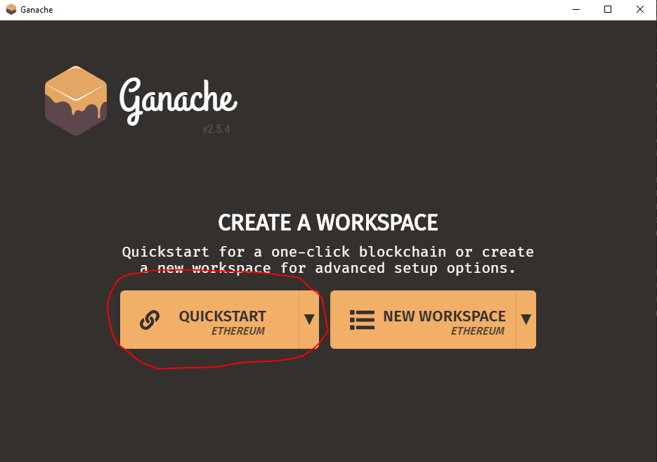
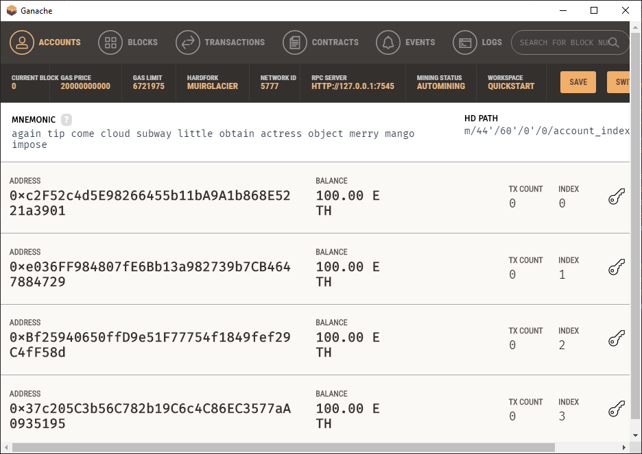
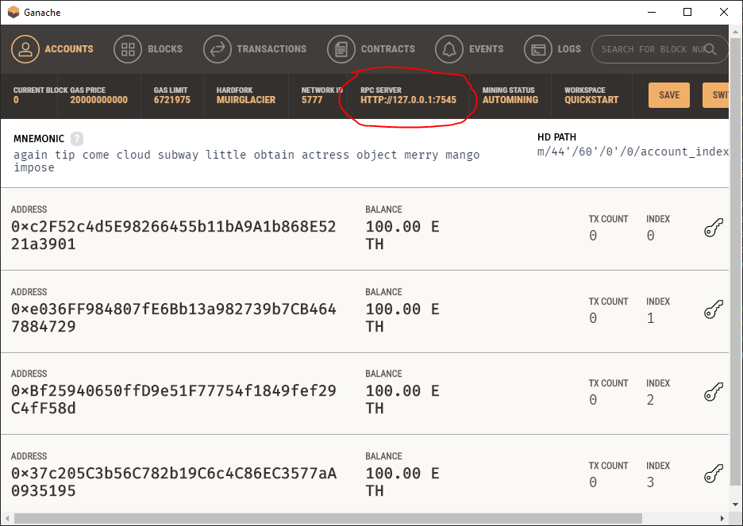

# Art NFT Marketplace


# Description
A decentralized application (dApp) is an application built on a decentralized network that combines a smart contract and a frontend user interface. On Ethereum, smart contracts are accessible and transparent – like open APIs – so your dApp can even include a smart contract that someone else has written.

This project demonstrates how to build decentralized applications (dApps) and decentralized storage for non-fungible token (NFT) contracts.  We do this by building our (dApp) smart contract on the the ERC-721 Non-Fungible Token Standard defined in the Ethereum Improvement Proposal (EIP)–721.

We use the ERC-721 Non-Fungible Token Standard contract to demostrate how users can buy or sell artwork NFTs in a decentralized marketplace. Users are able to select their accounts and register new artwork tokens through a web interface. Users will also be able to display the tokens for their accounts so that they can display the artwork on the webpage.


# Initial SetUp

### Installing Required Tools


- [Ganace](https://www.trufflesuite.com/ganache/) - Ganache is a tool that allows you to quickly set up a local blockchain, which you can use to test and develop smart contracts.  Follow the instructions on the Ganache Download page to download and install this tool on your local machine.

- [Metamask](https://metamask.io/) - MetaMask is a digital wallet for the Ethereum blockchain. Follow the instructions on the MetaMask Download page to install MetaMask in your web browser.

- [Pinata (Create a Token)](https://www.pinata.cloud/) - Pinata is for storing and managing your NFT media . It uses the Interplanetary File System, or IPFS, to create content-addressable hashes of data. Follow the instructions on the Pinata page to create a token and start using Pinata


### Other Requirements

- [Git](https://git-scm.com/downloads) 
- [Visual Studio Code](https://code.visualstudio.com/)
- [Remix-Etherium IDE](https://remix.ethereum.org/) 


### Clone

Clone a copy of the repo:

```bash
git clone https://github.com/rdillens/Smart_Contracts.git
```

Change to the SDK's directory:

```bash
cd Smart_Contracts
```

### Create virtual environment: 

Create new environment in conde with depenencies:

```bash
conda create  --name SmartContracts_env python=3.7 --file requirements.txt
```

Or install the following packages:
```bash
pip install streamlit
```
```bash
pip install streamlit-pages
```
```bash
pip install python-dotenv
```
```bash
pip install web3
```
# Getting Started

## Step 1: Run Ganache

 ### Choose Quickstart




 ### Ganache provides a local development blockchain for our app.



## Step 2: Open Remix


## Step 3: Import contract file Into Remix


## Step 4: Compile Contract 


## Step 5: Copy Contract Address and Paste Into .env File


## Step 6: Copy Ganache URI to .env file

### The RPC URL needs to be needs to be added to WEB3_PROVIDER_URI property of the .env file. 



 ### The .env file WEB3_PROVIDER_URI containes the Ganache RPC URL to allow the  WEB3 Provider to connect to our local block chain provided by Ganache.


```bash
PINATA_API_KEY= XXXXXXXXXXXXXXXXXXXXXXXXXXXXXXXXXXXXX
PINATA_SECRET_API_KEY= XXXXXXXXXXXXXXXXXXXXXXXXXXXXXX
WEB3_PROVIDER_URI=http://127.0.0.1:7545
SMART_CONTRACT_ADDRESS= [Address of Deployed Contract]
```

## Step 7:  Run Streamlit App

```bash
streamlit run app.py
```


## Contributors
- Chafic Charafeddine
- Remy Dillenseger
- Gregory Douglas
- Jose Medina